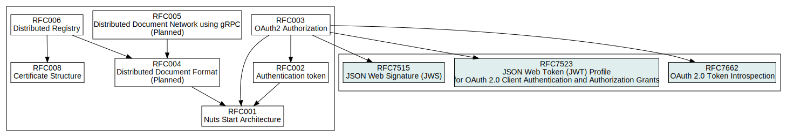

# Welcome

Welcome to the draft section of the Nuts specification documentation. This space is used to compose completely new RFCs. Existing RFC's can be altered through Github.

## Structure

The diagram below shows how the RFCs relate to each other.

