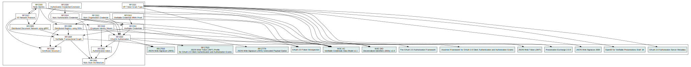

# Nuts specifications

## Welcome
Dear reader. This page contains the Nuts specification documents in the form of a Request For Comments (RFC). These specifications address several subjects which together can be used to build a piece of software which is capable of interacting with the Nuts network.

## Who is this page for?

The RFCs are written with a technical audience in mind but we aim to keep the introduction sections readable for a broader audience. One might find the RFCs interesting when designing new healthcare exchange scenarios, connecting software to the Nuts network and wanting to know more about how a decentralised network like Nuts works.

If you are searching for more information about the Nuts initiative, its community or the use cases in general make sure to also visit our website at https://nuts.nl.

## How to comment on the RFCs

The idea of these RFC is to invite people to comment. If you think there are improvements to make, you can open an issue on the [GitHub repository](https://github.com/nuts-foundation/nuts-specification/tree/master/rfc) or contact the community on [Slack](https://join.slack.com/t/nuts-foundation/shared_invite/zt-yix61es0-kEMbrNdEgj89vyNZi49fYA) in the #specification channel.

## Structure

The specification builds on existing standards. The diagram below shows how the RFCs relate to each other.

