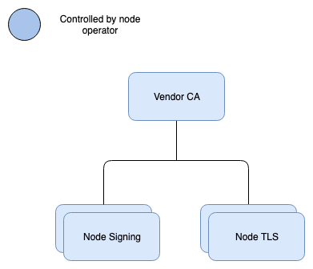

# RFC008 Certificate Structure

|  |  |
| :--- | :--- |
| Nuts foundation | W.M. Slakhorst |
| Request for Comments: 003 | Nedap |
|  | R.G. Krul |
|  | Nedap |
|  | October 2020 |

## Certificate Structure

### Abstract

This RFC specifies which certificates are used in which situation. The basic concept is that a vendor creates a self-signed CA certificate and that this certificate can be trusted by various methods. The vendor CA is then used to sign various other certificates, each with a different purpose \(signing, TLS, etc\). The separation between vendor CA and other certificates allows for various deployment scenarios. All certificates, except for the vendor CA, are short-lived certificates with a maximum life-span of 4 days. This removes the requirement for supporting CRLs and OCSP responders. Beside the before mentioned certificates, server certificates issued by the well-known public authorities still play a role.

### Status of document

This document is currently a draft.

### Copyright Notice

This document is released under the [Attribution-ShareAlike 4.0 International \(CC BY-SA 4.0\) license](https://creativecommons.org/licenses/by-sa/4.0/).

## 1.  Introduction

In a secure network certificates play an important role. They are required to set up a TLS connection, and they provide a mechanism for establishing authenticity and integrity of published data.

When it comes to certificates, we’d like to be at the edge of usability and security. All administrative actions regarding keys should be simple and logical to the administrator and yet it should follow the latest security standards. A very elaborate certificate tree structure covers all requirements but is too complicated to understand. Complication can lead to human error, which in the case of private key management leads to security holes. Apart from supporting the production use-case, we also want to make things easier for development and demonstrations. This means that the chosen solution supports a wide variety of tools and/or scripting.

## 2. Terminology

* **CA**: Certificate authority as defined by [RFC2459](https://tools.ietf.org/html/rfc2459).
* **event type**: the type of entry in the document log.
* **node**: a running instance of a Nuts implementation \(a.k.a. Nuts node\).
* **node operator**: an organization running a node. Typically a vendor that creates healthcare software for care organizations.
* **shared network state**: the accumulation of events or document log entries that are in the right order and where every node agrees upon.
* **truststore**: The file that contains the trusted CA's.

Other terminology is taken from the [Nuts Start Architecture](rfc001-nuts-start-architecture.md#nuts-start-architecture).

## 3. Overview

Nodes establish trust by using a PKI infrastructure. This infrastructure doesn't rely on central certificate authorities \(CA\) but rather on 3rd party proofs. Each vendor is a CA with a root certificate. Nodes trust a CA by either manually adding it to a truststore or relying on another cryptographic proof. The first mechanism relies on out-of-band distribution and face-to-face identity checking. For the second mechanism, all nodes should agree on which proofs to trust. This is not part of the specification, it should be part of some network agreement. [RFC006 Distributed Registry](https://github.com/nuts-foundation/nuts-specification/tree/4127385cab773917fd5bd642dd7f2fa94f48655e/rfc/rfc006-distributed-registry.md) explains which type of proofs must be supported.

The figure above shows the vendor CA tree. The lines indicate that a lower certificate is signed by a higher one in the graph. As can be seen, the vendor CA is the root of the tree. Each vendor MUST generate a self-signed certificate and have it published by another node. An organization proof SHOULD be published in the same event linking the certificate to the real world organization. See \([RFC006 Distributed Registry](https://github.com/nuts-foundation/nuts-specification/tree/4127385cab773917fd5bd642dd7f2fa94f48655e/rfc/rfc006-distributed-registry.md)\) for a detailed explanation on how trust can be established between nodes.

Typically, a PKI infrastructure also defines CRLs and OCSP endpoints. More recent insights show that short-lived certificates offer the same level of security since CRLs and OCSP return values tend to be cached for a longer period of time. A case could even be made that short-lived certificates are more secure since they allow for faster key rotation as well. [Short lived certificates @ Netflix](https://medium.facilelogin.com/short-lived-certificates-netflix-fd5f3ae5bc9)

The node certificates from the diagram are specific per machine/deployment. This allows for multiple topologies. The private key SHOULD never leave the deployment instance. Together with short-lived certificates, the private key can even be stored in memory rather than somewhere else, increasing security.

The node signing certificates are used for signing documents \([RFC004 Distributed Document Format](https://github.com/nuts-foundation/nuts-specification/tree/4127385cab773917fd5bd642dd7f2fa94f48655e/rfc/rfc004-distributed-document-format.md)\) and for signing JWTs\([RFC003 OAuth2 authorization](rfc003-oauth2-authorization.md)\). The node TLS certificates are used for connections between nodes. They also are short-lived and are deployment instance specific.

Summarized, there are 3 classes of certificates: 1. Vendor CA certificates are used to issue certificates. 2. TLS certificates are used for authentication when connecting to node endpoints. 3. Signing certificates are used for signing documents on the document log, so their authenticity can be established. They are also used to sign JWTs in an OAuth flow.

In the next chapter, these certificates will be explained in detail.

## 4. Certificate types

These paragraphs describe the main usage of certificate usage. All edge cases are described in the Key compromisation matrix paragraph in the Private key management chapter. Whenever the term certificate is used in the context of signing, we mean the private key associated with the public key of the certificate.

### 4.1. Vendor CA

This CA signs TLS certificates and signing certificates. This is a very important certificate and it MUST be stored securely in a secure key management module. This module MUST only be accessible from within the vendor’s infrastructure. This will allow nodes that support Nuts functionality to request and renew certificates. This certificate identifies the vendor, it MUST have its identifier \(vendor ID\) as SAN. It may only be used to issue certificates for its own organization.

| Field | Value |
| :--- | :--- |
| Validity | 3 years |
| Is CA? | true |
| Key Usage | certSign |
| SubjectAlternativeName | otherName=1.3.6.1.4.1.54851.4: |
| Subject | Free to choose, but must comply with the following rules: Country \(C\) must be present and contain the vendor’s country where it’s registered\*. Organization \(O\) must be present and contain the organization’s name as registered. Common Name \(CN\) MUST be present and have the following format:  CA. ‘Legal Name’ contains the name of the vendor as registered. ‘Optional Text’ is optional and can contain anything the vendor wishes to specify. ‘CA’ postfix is mandatory, indicating it’s a Certificate Authority |

\* as registered means: as the legal entity is registered \(e.g. Chamber of Commerce registration\)

### 4.2. Signing certificate

Any change to the shared state of the network MUST be signed by the node that announces it \(event signing\). This means that every node needs their own signing key, linked to the identity of the vendor CA. The vendor CA can’t be used, since that CA should be kept secure and separate from any service open to the outside. The signing certificate acts as a proof of ownership for the vendor. This certificate MAY also be used to sign the JWTs for the OAuth flow. The certificate MUST NOT be valid for more than 4 days, meaning the vendor SHOULD support automatic renewal/rekeying within the infrastructure.

| Field | Value |
| :--- | :--- |
| Validity | 4 days |
| Is CA? | false |
| Key Usage | digitalSignature, non-repudiation |
| SubjectAlternativeName | otherName=1.3.6.1.4.1.54851.4: |

### 4.3.

The TLS certificate is used for setting up connections between the nodes. When a vendor adds another vendor to the network, its CA \(Vendor CA\) will be added to the shared network state. The TLS certificate that the vendor will use MUST be trusted by the other vendors implicitly. To support configuration of a reverse-proxy \(and for internal use\), the node COULD provide an endpoint with the current approved CA’s. The validity of the TLS certificate MUST NOT be longer than 4 days.

| Field | Value |
| :--- | :--- |
| Validity | 4 days |
| Is CA? | false |
| Key Usage | digitalSignature |
| Extended Key Usage |  |

serverAuthentication, clientAuthentication \| \| SubjectAlternativeName \| otherName=1.3.6.1.4.1.54851.4: \|

## 5. Private key algorithms

The private key algorithm MUST be one of _secp384r1_, _secp521r1_. 384 bits is one step above 256 which should already give 10 years of protection. When key rotation is set up from the beginning, we can change the desired key algorithm easily. A specific command SHOULD be available on a node to help the administrator achieve this. Some diagnostics on when a key has to be rotated COULD be provided as well.

## 6. Private key management

The following paragraphs are recommendations since it involves the internal workings of a node.

### 6.1. Storage

Keeping the private key safe is of enormous importance. The best way is to not store it next to the application or service at all. A nuts node SHOULD support two ways of using a private key for specific actions \(mostly CA related\). The first is to pass the private key location as argument to the specific CLI commands. This is not recommended for production, since it involves a key on disk, even if it is encrypted with a passphrase. It’s useful for a local setup or development. The preferred way is to store the key \(and certificate\) in a [Hashicorp Vault instance](https://www.vaultproject.io/). Vault supports all required CA commands\(Sign, self-sign and revoke\). For all relevant commands an access token has to be used as an argument in the CLI command. This access token gives access to the required Vault commands. The benefit is that the administrator does not need access to all stored keys and that the access token can be short-lived.

### 6.2. Key compromisation matrix

The matrix below contains some basics on what to do in various situations involving the private key of the various certificates.

|  | Vendor CA | TLS | Signing |
| :--- | :--- | :--- | :--- |
| where is the key used? | For signing signing keys and TLS keys | in TLS connections as client certificate. It's basically the gateway to the Nuts network. | In the registry for signing events. And for signing JWTs |
| how is it approved? | Self signed, but has to be added by another node to the network. Has to be accompanied with an organization proof | It is automatically accepted due to its CA being accepted | It is automatically accepted due to its CA being accepted |
| how often is it used? | Every 3 days per issued certificate. | Multiple connections to multiple registries and for each connection to retrieve data/get an access token. | Everytime an entry is added to the registry and when a JWT is signed. |
| algo's allowed? | secp384r1 | TLS 1.2+, ECDHE and AES-GCM | secp384r1/Ed25519 |
| what if key is stolen? | If stolen, the organization proof means must be used to revoke the old key and approve a new one. | It's only valid for a few days. | It's only valid for a few days. |
| what if key is lost? | The organization proof means must be used to approve a new one. | Generate a new key and certificate | Generate a new key and certificate |
| what if key is old? \(key rotation\) | Publish a new self-signed certificate | same as lost | same as lost |
| how is the cert revoked? | By registering a new key using the organization means | expires | expires |

