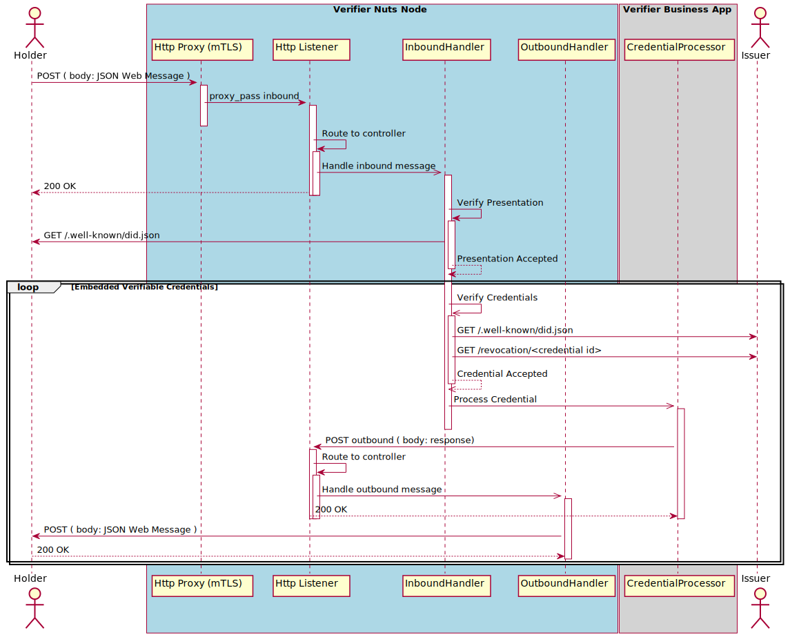

# RFC009 Verifiable presentations


## Abstract

We use credentials every day. Your driving license, certificates of courses, university degrees. All are examples of credentials. There are also many examples in healthcare, such as a prescription, diagnosis, or allergies. Credentials can be issued to a person or an organization.Verifiable credentials are a generic mechanism to issue, hold, and verify claims on a subject. This use case describes how a holder presents verifiable credentials to a verifier. The system in its role of verifier receives and verifies the origin, integrity, and validity of the credentials. 

Verifiable credentials are an implementation of the[ W3C Verifiable Credentials Data Model](https://www.w3.org/TR/vc-data-model/). Other roles are issuer and holder. These roles are described in other use cases (RFCs).

## Status of document

This document is currently a draft. 

### Topics for discussion

This document needs to be discussed on the following issues:Support of multiple networks. 

- The DID method supports multiple networks in the schema of the identifier. The method resolves to a verifiable data registry. The current network is limited to participants of the Nuts network because of the need to have a Nuts PKI Certificate. Local Governments, and even care providers, might not use the Nuts network. Local Governments will probably use nId. Other networks should be supported.
- The implementation will use partials/ideas from the DIDComm message standard to send a request and response, including the error report message. DIDComm 2.0 (https://identity.foundation/didcomm-messaging/spec/) is currently in development and includes the draft version of JSON Web Message (https://tools.ietf.org/id/draft-looker-jwm-01.html). Usage of parts of an international standard in development is preferred above the development of a Nuts standard.
- Trust is based on the use of Nuts certificates. To extend the trust to other domains and other networks, support for other certificates than the Nuts certificate is needed, or the use of verifiable credentials to proof an identity. Part of the network perspective is actor responsibility. The actor who gives access to data is repsonsible to ask proof and to conclude that the other actor has authorization.
- Part of the onboarding on the network is findability of the particepant.
- Support for an nId DID method for local governments. nId uses JSON Web Key Stores for verification.  Should be discussed to change this to DID documents. JSON Web Key Stores can be resolved from https://example.com/.well-known/jwks.json. The verifiable credential specifications state the the the `kid` can refer to a key in a [DID document](https://www.w3.org/TR/vc-data-model/#dfn-decentralized-identifier-documents), or can be the identifier of a key inside a JWKS.


## Copyright Notice


This document is released under the [Attribution-ShareAlike 4.0 International (CC BY-SA 4.0) license](https://creativecommons.org/licenses/by-sa/4.0/).


## 1. Introduction

The use cases for verifying credentials data model holds the four roles as described in[ https://www.w3.org/TR/vc-use-cases/](https://www.w3.org/TR/vc-use-cases/). The data model (https://www.w3.org/TR/vc-data-model/) adds an extra role, the verifiable data registry. Verifiable credentials are containers for different types of claims.


This RFC describes the verify claim use case and its implementation in the Nuts network. The goal is to enable the verification of credentials presented by a holder. The credential is presented as a verifiable presentation with proof of the holder. The verifiable credentials are embedded in the presentation and hold proof of the issuer. It also contains a reference to the revocation registry of the issuer.

To be able to verify the proof of the holder and the issuer, the verifier must resolve their identifiers to a decentralized identifier (DID) document (https://www.w3.org/TR/did-core/). The document contains the verification method, the public key of the holder, or the issuer.


### 1.1. Limitations to the support of the specification

The W3C specifications are Recommendations and can be altered in time. The RFC describes the implementation in the Nuts network and has limited support on the following issues:

- The implementation supports the JSON Web Keys as key format (verification method type equals JsonWebKey2020).
- The implementation uses JSON Web Tokens as a proof format.
- The implementation has limited support for key types (only OKP) and algorithms (only EdDSA).
- The implementation has limited support for DID methods (only web method), which resolve to a DID document in a verifiable data registry.
- ...


### 1.2 Bootstrapping the use of decentralized identifiers

The current use of hierarchical public key infrastructures does have challenges (See: https://tools.ietf.org/html/draft-iab-web-pki-problems-05). One of the challenges is a privacy concern with mutual TLS: *"when mutual authentication is used, the browser sends the client certificate in plaintext to the webserver in the TLS handshake. This allows the browser user's identity to be tracked across many different sites by anyone that can observe the traffic"*. 

Decentralized Public Key Infrastructure, or DPKI, is an alternative approach to [reboot the web of trust](https://www.weboftrust.info). Decentralized identifiers  eliminates dependence on centralized registries for identifiers as well as centralized certificate authorities for key management, which is the standard in hierarchical PKI. In cases where the DID registry (also knwon as verifiable data registry) is a [distributed ledger](https://en.wikipedia.org/wiki/Distributed_ledger), each entity can serve as its own root authority. This architecture is referred to as decentralized PKI (DPKI) (source: [Wikipedia](https://en.wikipedia.org/wiki/Public_key_infrastructure#Decentralized_PKI)). 

#### So, what’s a DID?

According to the w3c, a Decentralized Identifier, or DID, is *“a globally unique identifier that does not require a centralized registration authority because it is registered with distributed ledger technology or other form of decentralized network.”*. 


**From A Primer for Decentralized Identifiers** (https://w3c-ccg.github.io/did-primer/)

In 2016 DID developers agreed with a suggestion from Christopher Allen “*that DIDs could be adapted to work with multiple blockchains by following the same basic pattern as the URN (*Unified Resource Name) *specification*”.


The key difference is that with DIDs the namespace component identifies a **DID method**, and a **DID method specification** specifies the format of the method-specific identifier. 


DID methods (further explained below) define how DIDs work with a specific distributed ledger. All DID method specs must define the format and generation of the method-specific identifier. Note that the method specific identifier string **must** be unique in the namespace of that DID method. To bootstrap the use of decentralized identifiers, this RFC uses the web method to realize the decentralized network. Additional methods may be added to support the needs of users.


## 2. Terminology

The terminology used is defined in https://www.w3.org/TR/did-core/#terminology and https://www.w3.org/TR/vc-data-model/#basic-concepts.


## 3. Requirements for verifiable credentials and presentation 

An authenticated participant of the Nuts network holds credentials and presents one or more of these credentials to the verifier. The use case describes the verification of the presentation and the credentials. The business logic of handling the content of the credentials is out of scope in this description.

### Trigger event / precondition

- *The holder posts a request to the verifier with the verifiable presentation.*
- *The verifier must have NTP configured for the timezone of the location where the organization resides that is accountable for processing the verifiable presentation/credential.*
- *The holder hosts a service to receive messages.*
- *The holder is an authenticated participant of the Nuts network (under discussion, see known issues).*
- *The holder and verifier use mutual TLS for authentication of domain and organization.*
- *TLS is also used to encrypt the transport channel for the request and response messages.*

### Main success scenario

1. *The system receives the inbound message*

2. *The system verifies the presentation as token performing the next steps.*

   <ol type='a'>
     <li><i>The system decodes the token.</i></li>
   <li><i>The system resolves the DID document of the issuer of the token.</i></li> 
   <li><i>The system searches for the tokens key identifier in the DID document. The key identifier must identify an assertion method that embeds, or relates to, a verifiaction method.</i></li>
   <li><i>The system reads the verification method embedded in, or related to, the assertion method.</i></li>
   <li><i>The system verifies the origin, integrity, and validity of the token.</i></li>
   </ol>

3. *For every embedded verifiable credential, the system decodes and verifies the verifiable credential as token performing the previous steps 2a to 2e. When all verifiable credentials are verified valid, the system continues to the next step.*

4. *For every embedded verifiable credential, the system queries the revocation list of the issuer if the `credentialStatus` property is available. The revocation list contains all credentials and their status.*

5. *For every embedded verifiable credential, the system queries the issuer trust list if the issuer DID is part of the list.*

6. *For every embedded verifiable credential, the system triggers the credential handler to process the verifiable credential.* *When the credential handler needs to send a response to the holder, the system sends the inbound message to the holder*

The use case ends.

### Extensions

#### Extension 2b-2: Proof bi-directional relationship between the controller of an origin and a DID

** **To be discussed if needed** **

At 2b when the system resolves the DID using the web method, the system verifies that the DID controls the origin (the domain where the DID document resides).

1. The system verifies the domain linkage credential for the DID used in the token. 

   The domain linkage credential is a self-issued credential. 

   The verification of the domain linkage credential is performed with the same steps as any other verifiable credential.

   When the verification fails, the system sends an error report as a response of the original message, otherwise the system continues the use case.

See the specification of the linkage credential: https://identity.foundation/.well-known/resources/did-configuration/. The credentials must be a valid credential within the Nuts implementation using JSON Web Tokens as proof format. 

The DID Configuration resource provides proof of a bi-directional relationship between the controller of an origin and a DID via cryptographically verifiable signatures that are linked to a DID's key material. Making it possible to connect existing systems and [Decentralized Identifiers](https://w3c.github.io/did-spec/) (DIDs) is an important undertaking that can aid in bootstrapping adoption and usefulness of DIDs. One such form of connection is the ability of a DID controller to prove they are the same entity that controls an origin.

The use case will have the following extensions. When an extension is a processing or validation error, the system will report the error to the holder as a response of the original message (same conversation).

### Error handling

#### Error 2a-1: The verifiable presentation is not encoded as JSON Web Token

#### Error 2b-1: The DID can not be resolved

Table of supported DID methods:

| DID Method                                                   |
| ------------------------------------------------------------ |
| Web method (see: https://w3c-ccg.github.io/did-method-web/). <br />The DID document resource *MUST* exist at the origin's root, in the [IETF 8615 Well-Known Resource](https://tools.ietf.org/html/rfc8615) directory, as follows: <br />Example: `did:web:example.com` resolves to https://example.com/.well-known/did.json |

#### Error 2c-1: The assertion method can not be found

The system is not able to find the assertion method identified by the `kid`.

#### Error 2c-2: The assertion method embeds or relates not to a verification method

The system is not able to find the verification method referenced by the assertion method and the assertion methods does not embed a verification method.

#### Error 2d-1: The verification method type is not supported

The system concludes that the verification method type is not equal to JsonWebKey2020.

See also: https://w3c.github.io/did-spec-registries/

#### Error 2d-2: The curve is not supported

The system concludes that the curve (`crv`) of the JSON Web Key is not equal to EdDsa (Edwards curve).

#### Error 2d-3: The key type is not supported

The system concludes that the key type (`kty`) of the JSON Web Key is not equal to OKP (Octet Key Pair with subtype Ed25519).

#### Error 2e-1: The signature is not valid.

The system concludes that the tokens signature can not be decoded with the public key in the verification method.

#### Error 2e-2: The token is not intended for the verifier

The system concludes that the verifier is not part of the intended audience (`aud`) of the token (should only occur when verifying a verifiable presentation).

#### Error 2e-3: The token can not be used before date

The system concludes that the current date is before the date the token can be used (`nbf`).

#### Error 2e-4: The token is expired

The system concludes that the current date is after the expiration date (`exp`) of the token.

#### Error 4-1: The  verifiable credential is suspended or revoked

The system concludes that the credential has status suspended or revoked.

## 4 Realization of the use case


### Overview





### 4.1 Inbound message

An transport layer is needed to enable routing between actors. It also enables to use message types, envelopes and encrypt and sign the payload independantly from the content of the payload. The transport layer therefore is autonomous. 

To realize this use case, plain text messages are used. Precondition is peer to peer transport between holder and verifier, that the message is not transported across security boundaries, and mutual transport layer security (mTLS) is used between peers.

This specification is inspired on the DIDComm specification. See https://identity.foundation/didcomm-messaging/spec/ and the proposed JSON Web Message format. See: https://tools.ietf.org/id/draft-looker-jwm-01.html.


```json
"protected": {
    "alg": "none", 
    "typ": "JWM"
},
"payload": {
    "id": "<unique identifier of the message, for example: urn:uuid:ef5a7369-f0b9-4143-a49d-2b9c7ee51117>",
    "type": "basic-message",
    "from": "<did of holder>",
    "to": "<did of intended verifier>",
    "exp": "<expiration date>",
    "iat":"<issuance date>",
    "thread_id": "<identifier to associate the JWM to a group of related messages (conversation)>",
    "reply_url": "<url to which the response of the message can be sent>",
    "body": {
        "message": "<base64url-encoded JWT as string containing the verifiabble presentation>"
    }
},
"signature": ""

```

Date and time values MUST be a number containing a NumericDate value (Unix epoch timestamps).


### 4.2 Outbound message

The outbound message is send as a response to the inbound message.

```json
"protected": {
    "alg": "none", 
    "typ": "JWM"
},
"payload": {
    "id": "<unique identifier of the message, for example: urn:uuid:ef5a7369-f0b9-4143-a49d-2b9c7ee51117>",
    "type": "basic-message",
    "from": "<did of verifier>",
    "to": "<did of holder>",
    "exp": "<expiration date>",
    "iat":"<issuance date>",
    "thread_id": "<same identifier as used in inbound message>",
    "body": {
        "message": "<response>"
    }
},
"signature": ""

```

  Date and time values MUST be a number containing a NumericDate value (Unix epoch timestamps).


### 4.3 Error report

The error report message is send as a response to the inbound message.

```json
"protected": {
    "alg": "none", 
    "typ": "JWM"
},
"payload": {
    "id": "<unique identifier of the message, for example: urn:uuid:ef5a7369-f0b9-4143-a49d-2b9c7ee51117>",
    "type": "error-report",
    "from": "<did of verifier>",
    "to": "<did of holder>",
    "exp": "<expiration date>",
    "iat":"<issuance date>",
    "thread_id": "<same identifier as used in inbound message>",
    "body": {
        "message": "<error message as specified in use case>"
    }
},
"signature": ""

```

  Date and time values MUST be a number containing a NumericDate value (Unix epoch timestamps).


## 5. Realization of the verifiable presentation

The verifiable presentation holds the credentials that are presented to the verifier.

```json
"protected": {
    "alg": "EdDSA", 
    "kid": "<reference to assertion method in did document>",
    "typ": "JWT"
},
"payload": {
    "jti": "<presentation id>",
    "iss": "<did of holder>",
 		"aud": "<did of intended verifier>",
 		"nbf": "<valid from date, same as issuance date or later>",
 		"exp": "<expiration date>",
 		"iat": "<issuance date>",
    "vp": {
        "@context": ["https://www.w3.org/2018/credentials/v1"], 
        "type": ["VerifiablePresentation"], 
        "verifiableCredential": ["<base64url-encoded JWT as string>"]
    }
},
"signature": "<signature of the holder>"

```

Date and time values MUST be a number containing a NumericDate value (Unix epoch timestamps).


## 6. Realization of the verifiable credential

The JSON Web Token of the credential.

```json
"protected": {
    "alg": "EdDSA", 
    "kid": "<reference to assertion method in did document>",
    "typ": "JWT"
},
"payload": {
    "jti": "<credential id>",
    "iss": "<did of issuer>",
 		"sub": "<did of holder>",
    "nbf": "<valid from date, same as issuance date or later>",
    "exp": "<expiration date>",
    "iat": "<issuance date>",
 		"vc": {
        <json of the verifiable credential>
    }
},
"signature":
```

Date and time values MUST be a number containing a NumericDate value (Unix epoch timestamps).


## 7. Realization of the status registry

The verifiable credential SHOULD have a property for the discovery of information about the current status of a verifiable credential. The property is specified in the verifiable credential data model (https://www.w3.org/TR/vc-data-model/#status).

Allowed status of a verifiable credential is valid, suspended, or revoked.

```json
 "credentialStatus": {
    "id": "https://example.com/status/<status list identifier>",
    "type": "CredentialStatusList2017"
  },
```

The credentials list is specified in: https://w3c-ccg.github.io/vc-csl2017/


## 8. Realization of the issuer trust list

Downloaded list of trusted issuers.


## 9. Realization of the schema verification registry

Not implemented.

